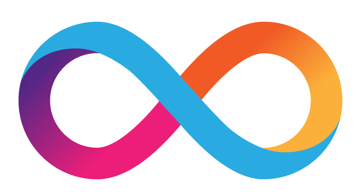

# Awesome DFINITY 

  

A curated list of awesome projects and resources relating to [DFINITY](https://dfinity.org) and the Internet Computer.

Projects denoted with a ✓ are *deployed to the Internet Computer*!

If you want to contribute projects or tools, please first read our [Contributing](.github/CONTRIBUTING.md) guidelines and agree to abide by our [Code of Conduct](.github/CODE_OF_CONDUCT.md).

---

## ♾️ Foundation Dapps

- ✓ [NNS Governance](https://nns.ic0.app/) - A Governance Dapp for voting on Internet Computer governance proposals

- ✓ [Internet Identity](https://identity.ic0.app/) - Internet Identity service enables you to authenticate securely and anonymously when accessing applications on the Internet Computer

## 🌐 Community projects

Submit a pull request to add a link to your repository here.

### 🆕 Latest Community Projects

- ✓ [Motoko School](https://anyuk-uiaaa-aaaah-aaduq-cai.raw.ic0.app/) - A collaborative online school

- ✓ [The Wall](https://rivyl-6aaaa-aaaaf-qaapq-cai.raw.ic0.app/) - The Wall is a crossover Ethereum/Internet Computer demo app. Create an IC Identity simply by signing a Metamask message. Then, write the wall! 

- ✓ [DSCVR](http://dscvr.one/)

- ✓ [OpenChat](https://7e6iv-biaaa-aaaaf-aaada-cai.ic0.app/)

- ✓ [Internet Computer Tools](https://bmht6-iiaaa-aaaad-qabeq-cai.raw.ic0.app/)

- ✓ [Canlista](https://k7gat-daaaa-aaaae-qaahq-cai.ic0.app/)

- [Motoko Top Up Canister](https://github.com/ORIGYN-SA/motoko_top_up_canister) - A Motoko service for topping up canisters

- [IC Deploy Action from Fleek](https://github.com/FleekHQ/IC-Deploy-Action) - The Github Action will trigger a new deployment to the Internet Computer when commits are pushed.

- [Hypotenuse Oracles](https://hypotenuse.ca/) - Hypotenuse DFINITY Oracles is a framework for building blockchain oracles for the Internet Computer.
  - [Framework Repository](https://github.com/hyplabs/dfinity-oracle-framework)
  - [Weather Oracle Plugin](https://github.com/hyplabs/dfinity-oracle-weather)
  - [Crypto Oracle Plugin](https://github.com/hyplabs/dfinity-oracle-crypto)

- [DFinance](https://dfinance.ai/) - DFinance is building basic DeFi components for the Internet Computer, including: token standard, DEX, stablecoin and lending platform.
  - [motoko-token](https://github.com/dfinance-tech/motoko-token): ERC20 style token template, reference:
    - [Motoko Token](https://github.com/flyq/motoko_token) Motoko Token by Flyq
    - [Motoko Token](https://github.com/enzoh/motoko-token) Motoko Token by Enzoh
  - [DToken](https://github.com/dfinance-tech/dtoken): Token issuance app
  - [DFinance](https://github.com/dfinance-tech/dfinance): User interface

## Hackathon projects

The DFINITY Tungsten Hackathon channeled the energy and excitement of DFINITY's internal engineers over two days in June 2020 to build applications for the Internet Computer.

The following represent a few of the applications that teams developed over the two-day period:

- [Magnify](https://github.com/Dfinity-Bjoern/Magnify) - A secure video conferencing application using WebRTC.

- [Dual](https://github.com/egeyar/wochonecha/) - A social app for creating, completing, and tracking various challenges.

- [DFINITY Explorer](https://github.com/dfinityexplorer/dfinityexplorer-dashboard) - DFINITY Explorer is an open-source network dashboard built by the DFINITY community.

- [Babmeo](https://github.com/BerkeleyBlockchain/dfinity-research) - Babmeo is an image & video sharing site with transparent recommendations that integrates with DFINITY’s LinkedUp, BigMap, and BigSearch projects to recommend, store, and search videos.

### ✳️ Demo Day 2020 projects

- [Bonus](https://github.com/seniorjoinu/Bonus) - Next-generation loyalty system built on the Internet Computer.

- [Get Impact Now](https://github.com/getimpactnow/getimpactnow/) - Digital platform that enables responsible citizens to be a part of the decision-making process.

- [Internet Computer Queue System (ICQS)](https://github.com/davidp94/icqs-demo) - A bridge to legacy systems, such as email.

- [NNS Explorer](https://github.com/hashquark-io/nnsExplorer) - Mock explorer for the Internet Computer's Network Nervous System (NNS).

- [Sailfish](https://github.com/sailfish-app) - The gateway to open financial services on the Internet Computer.

---

##  Motoko Resources

### 📦 Motoko Package Managers
- [Vessel package manager](https://github.com/kritzcreek/vessel) - Add and manage packages, libraries, and dependencies for your Motoko programs.

### 📁 Motoko libraries

#### 🏗️ Data structures

- [motoko-bigsearch](https://github.com/matthewhammer/motoko-sequence/blob/master/service/BigSearch.mo) - A search service in Motoko, inspired by indexing and search systems like Apache Lucene.

- [motoko-crud](https://github.com/matthewhammer/motoko-crud) - A generic CRUD framework for Motoko.

- [motoko-dht](https://github.com/enzoh/motoko-dht) - A Motoko Distributed Hash Table (DHT) canister.

- [motoko-graph](https://github.com/matthewhammer/motoko-graph) - Graphical data models for Motoko.

- [motoko-sequence](https://github.com/matthewhammer/motoko-sequence) - Cache-friendly, persistent sequential data for Motoko.

#### 🧩 Algorithms

- [mo-parsec](https://github.com/crusso/mo-parsec) - A [Parsec](https://hackage.haskell.org/package/parsec)-based parser combinator library for Motoko.

- [motoko-adapton](https://github.com/matthewhammer/motoko-adapton) - Dynamic dependence graph and memoization techniques in Motoko.

- [motoko-redraw](https://github.com/matthewhammer/motoko-redraw) - 2D graphics and layout algorithms for Motoko.

#### 🧪 Testing

- [motoko-bigtest](https://github.com/matthewhammer/motoko-bigtest) - Long-running tests as/for IC services, via a Motoko-based DSL.

- [motoko-matchers](https://github.com/kritzcreek/motoko-matchers) - Composable assertions for unit testing.

---

## 🖥️ Frontend Development

- [ic-starter-templates](https://github.com/MioQuispe/ic-starter-templates) - Modern, unopinionated templates for React, Vue & Svelte powered by [ViteJS](https://vitejs.dev/)

### ⚛️ React

- [cra-template-dfx](https://github.com/taylorham/cra-template-dfx) - A [Create React App](https://github.com/facebook/create-react-app) template configured for using and deploying to IC canisters

### Vue

- [DFINITY-Vue](https://github.com/nop33/dfinity-vue) - Vue.js and Vuetify integration with DFINITY SDK bootstrap webpack project.

---

##  DFINITY Team Projects

### 💡 Tungsten Hackathon
The DFINITY Tungsten Hackathon channeled the energy and excitement of DFINITY's internal engineers over two days in June 2020 to build applications for the Internet Computer.

The following represent a few of the applications that teams developed over the two-day period:

- [Magnify](https://github.com/Dfinity-Bjoern/Magnify) - A secure video conferencing application using WebRTC.

- [Dual](https://github.com/egeyar/wochonecha/) - A social app for creating, completing, and tracking various challenges.

- [Bookworm](https://github.com/rstout/bookworm) - An open publishing application inspired by China Literature.

- [Shield](https://github.com/crusso/shield) - An app connecting at-risk people with nearby volunteers.

- [Hero](https://github.com/stanleygjones/hackathon) - A random "killer app" generator inspired by the Wu-Tang Name Generator.

### 🌱 Other Example Apps from the DFINITY team

- [IC Game Terminal](https://github.com/matthewhammer/ic-game-terminal) - Keyboard input (⌨) and graphical output (📺) for programs on the Internet Computer.

- [Journey](https://github.com/hansl/journey) - An open blog engine written for the Internet Computer.

- [Reversi](https://github.com/ninegua/reversi) - A multiplayer Reversi game on Internet Computer.

- [Superheroes](https://github.com/enzoh/superheroes) - A simple CRUD application that demonstrates using Motoko and React to create your own universe of superheroes that runs on the Internet Computer .

- [Fullstack To-do](https://github.com/krpeacock/simple-to-do) - Extension of the to-do example app with a frontend, using a minimal webpack dev-server configuration, web components, and unit and integration testing

