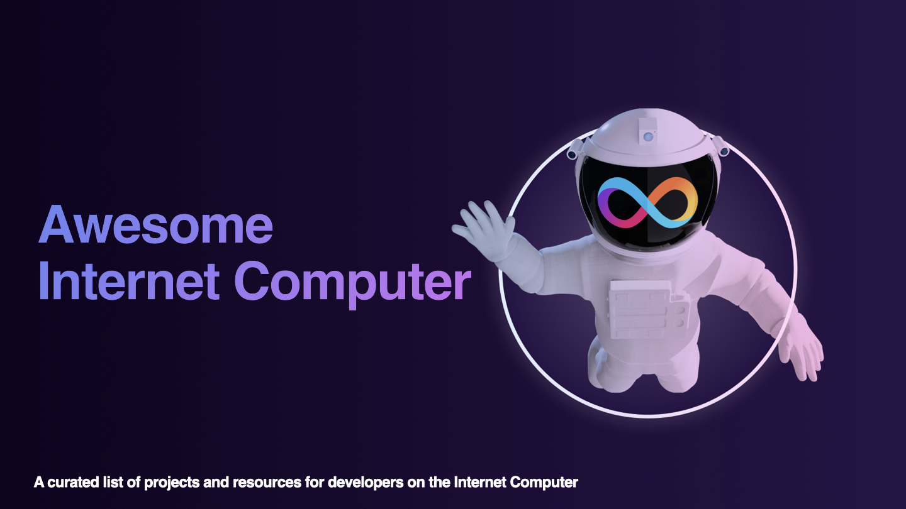

<!-- omit in toc -->

# Awesome Internet Computer 

The [Internet Computer](https://internetcomputer.org/) is a public blockchain that hosts smart contracts that run at web speed, can serve web from cyberspace, run efficiently, and can scale within an environment that has unbounded capacity. Smart contracts are a profoundly new and superior form of tamperproof and unstoppable software. They can imbue systems and services with new properties, enabling the reimagination of websites, systems, internet services and finance.

---

<!-- omit in toc -->

## Contents

- [Courses, Tutorials, and Samples](#courses-tutorials-and-samples)
- [Starters](#starters)
- [Client Libraries (Agents)](#client-libraries-agents)
- [Canister Development Kits (CDKs)](#canister-development-kits-cdks)
- [Dapp Development Platforms and Frameworks](#dapp-development-platforms-and-frameworks)
- [Developer Tooling](#developer-tooling)
- [Motoko](#motoko-1)
- [Candid](#candid)
- [Storage and Databases](#storage-and-databases)
- [Infrastructure](#infrastructure)
- [Fungible and Non-fungible Tokens (NFTs)](#fungible-and-non-fungible-tokens-nfts)
- [Messaging](#messaging)
- [Decentralized Finance](#decentralized-finance)
- [DAO Frameworks](#dao-frameworks)
- [Game Development](#game-development)
- [Wallets and Authentication](#wallets-and-authentication)
- [Dashboards, Explorers and Registries](#dashboards-explorers-and-registries)
- [Chain Fusion](#chain-fusion)
- [Internet of Things](#internet-of-things)
- [Decentralized AI](#decentralized-ai)
- [ZK](#zk)
- [How it works / Deep dives](#how-it-works--deep-dives)
- [Blogs](#blogs)
- [Communities and Communication](#communities-and-communication)
- [Bounties and Grants](#bounties-and-grants)

## Courses, Tutorials, and Samples

### Courses

- [Motoko Bootcamp - The DAO Adventure](https://github.com/motoko-bootcamp/dao-adventure) - Discover the Motoko language in this 7 day adventure and learn to build a DAO , on the Internet Computer.
- [The Complete Web Development Bootcamp](https://www.udemy.com/course/the-complete-web-development-bootcamp/) - Udemy course with a complete section on web3 development using the Internet Computer.
- [Web3, Blockchain, and the Internet Computer](https://www.youtube.com/playlist?list=PLSzsOkUDsvdubXF5XGGPffyQJ5CVU_9_c) - Youtube series (excerpt from The Complete Web Development Bootcamp).
- [AgorApp Motoko Course](https://agorapp.dev/editor/courses/motoko/learn-motoko/01-variables) - Interactive course for Motoko beginners.
- [Dacade TypeScript Smart Contract 101](https://dacade.org/communities/icp/) - Learn to build Dapps on the IC using TypeScript.
- [Web3 with TypeScript Bootcamp](https://github.com/Code-and-State/typescript-bootcamp) - Learn to build a DAO in 7 days, with TypeScript, on the Internet Computer.
- [Master Deployments of Static Websites on the Internet Computer](https://vspc.veriable.at/6513c18b1f66192cab8beb29.html) - Learn to host a static website on the Internet Computer using Astro.

### Tutorials and Samples

- [DFINITY Examples Repo](https://github.com/dfinity/examples) - Code samples from DFINITY.
- [Internet Computer Developer Hub](https://internetcomputer.org/docs/current/home) - The main entry point to documentation, guides and references.
- [Internet Computer Sample Dapps](https://internetcomputer.org/samples) - DFINITY-maintained and community-contributed samples and tutorials.

#### Simple / Getting started

- [Considerations for NFT Developers](https://internetcomputer.org/docs/current/developer-docs/best-practices/considerations-for-nft-devs) - Discussion of best practices for NFT developers.
- [Deploy Your First dApp on the IC in 10 Minutes!](https://www.youtube.com/watch?v=r5s7nD_XO0M) - Getting started video tutorial.
- [Frontends on the Internet Computer](https://www.youtube.com/watch?v=rjSDvTaEj3s) - Video tutorial on hosting frontends using the asset canister.
- [EmberJS Frontend for the Internet Computer](https://github.com/onehilltech/ember-cli-dfinity/blob/main/docs/getting-started.md) - Getting started tutorial using the hello example.
- [Intro to Building on the Internet Computer](https://www.youtube.com/watch?v=fSO___x3e3I) - Video introduction to building on the IC with Motoko and Rust.
- [Languages on the IC](https://medium.com/code-state/which-language-should-you-choose-to-build-on-the-internet-computer-%EF%B8%8F-851c31e9c28) - Guide on how to select the programming language for the IC.
- [Make Oracles Obsolete in under 5 Minutes](https://www.youtube.com/watch?v=3e12N9mcWhw) - Short video tutorial on HTTPS Outcalls in Motoko.
- [Rust + React (Typescript) + Internet Identity](https://medium.com/@ilbert/rust-react-typescript-internet-identity-on-the-internet-computer-35331ae2a4be) - Tutorial on setting up a project with Rust, React and Internet Identity.
- [C++](https://docs.icpp.world/getting-started.html) - Introduction to developing canisters in C++.
- [WebSockets on the Internet Computer: Getting Started](https://medium.com/@ilbert/websockets-on-the-ic-getting-started-5f8bcdfaabdc) - Tutorial on setting up a WebSocket connection from a frontend client to a canister.
- [Rust Modular Canister Template](https://github.com/SaorsaLabs/Template_Canister) - An example canister with stable storage, HTTP outcalls, timers and more.

#### Advanced

- [Access control](https://github.com/domwoe/access_control) - Demonstrator for access control patterns on the IC.
- [Backup and Restore](https://github.com/Factland/ic-factland/blob/main/backup/backup_restore.md) - Tutorial with code on backup and restore of canister state.
- [Canister guard in Rust](https://medium.com/@daviddalbusco/canister-guard-in-rust-on-the-internet-computer-c896f75e0cef) - Tutorial on the guard pattern for access control.
- [Code native Bitcoin](https://www.youtube.com/watch?v=LGegOFqP5x0) [(2nd part)](https://www.youtube.com/watch?v=H6Wu9n9Qwa8) - Video tutorials on how to use the native Bitcoin integration.
- [Cross-Chain ETH Payment and E-Commerce](https://github.com/b3hr4d/eth_payment_tutorial) - A step-by-step guide to building a cross-chain payment and e-commerce platform on the Internet Computer using Ethereum.
- [Environments](https://medium.com/@Catalyze.One/working-with-environments-on-the-internet-computer-59ed3d2a5763) - How to work with different environments (dev/staging/prod).
- [Hosting ERC 721 metadata](https://github.com/domwoe/erc-721-ic-assets) - Tutorial on hosting metadata and assets for ERC-721 NFTs on the IC.
- [Migration from Motoko to Rust](https://medium.com/dfinity/how-to-migrate-canister-smart-contracts-from-motoko-to-rust-3446a4b0c2ff) - How to Migrate Canister Smart Contracts from Motoko to Rust.
- [Converting ICP into Cycles](https://medium.com/dfinity/converting-icp-into-cycles-javascript-9b0dba8d8e00) - How to programmatically convert ICP into Cycles in NodeJS.
- [Social Platform Previews and SEO](https://medium.com/dfinity/how-to-configure-dapps-for-social-platform-previews-and-seo-62a55ee63d33) - Tutorial on how to configure dapps for social platform previews and SEO.
- [React Native + JWT Authentication + Rust Canister demo](https://github.com/ilbertt/ic-react-native-jwt-auth) - React Native (Expo) mobile app that uses the JWT minted from an authentication provider (Auth0 in this case) to authenticate on a Rust canister.

## Starters

- [create-ic](https://github.com/peterpeterparker/create-ic) - A simple command line tool to quickly create projects for the IC.
- [create-ic-app](https://github.com/MioQuispe/create-ic-app) - Modern, unopinionated templates for React, Vue & Svelte powered by [Vite](https://vitejs.dev/).
- [ic-rust-starter](https://github.com/ocluf/ic-rust-starter) - Starter for a Rust backend-only canister project.
- [vite-react-motoko](https://github.com/rvanasa/vite-react-motoko) - Full-Stack React/Motoko starter with live reload.
- [vite-sveltekit-motoko-ii](https://github.com/letmejustputthishere/vite-sveltekit-motoko-ii) – Full-Stack SvelteKit/Motoko start with Internet Identity Integration and live reload.
- [icp-dev-env](https://github.com/dfinity/icp-dev-env/tree/main) – A Docker image for a canister smart contract developer environment for ICP.
- [nextjs-ic-starter](https://github.com/dappblock/nextjs-ic-starter) - Next.js Internet Computer Starter Template.
- [IC in Dev Container](https://github.com/infu/internet-computer-start) - Run a local replica inside a Docker container with NNS in VS Code or GitHub Codespaces.
- [ic-eth-starter](https://github.com/dfinity/ic-eth-starter) - An advanced starter project for interacting with Ethereum on the Internet Computer (Beta).
- [IC Rust NextJS Starter](https://github.com/b3hr4d/ic-rust-nextjs) - A starter kit for building applications with Rust and Next.js on the Internet Computer.
- [Azle + NextJS Starter](https://github.com/mzurs/ic_template-Azle-NextJS) - Build Full-stack Dapp on IC with Typescript CDK and NextJS.
- [ic-alloy-basic-eth](https://github.com/kristoferlund/ic-alloy-basic-eth-frontend) - A multiuser Ethereum wallet starter/template using the Alloy EVM support libraries.

## Client Libraries (Agents)

Agents facilitate the interaction from clients with canisters on the Internet Computer. If you want to contribute an agent implementation check out this [Grant RFP](https://github.com/dfinity/grant-rfps/issues/4).

- [Interactive Tutorial on Agents](https://5n2bt-lqaaa-aaaae-aajfa-cai.raw.icp0.io/) - A low-level interactive tutorial on the inner workings of an Internet Computer agent.

### JavaScript/TypeScript

- [agent-js](https://github.com/dfinity/agent-js) - Collection of libraries to interact with the IC using JavaScript.
- [ic-js](https://github.com/dfinity/ic-js) - Collection of libraries for interfacing with the Internet Computer.
- [ic-use-actor](https://github.com/kristoferlund/ic-use-actor) - React hook to make interacting with Internet Computer canisters more fun!
- [ic-use-siwe-identity](https://github.com/kristoferlund/ic-siwe/tree/main/packages/ic-use-siwe-identity) - React hook for easy frontend integration with SIWE (Sign in with Ethereum) enabled canisters.
- [ic-use-internet-identity](https://github.com/kristoferlund/ic-use-internet-identity) - React hook that makes it easy to integrate IC Internet Identity into React applications.
- [ic-reactor/core](https://b3pay.github.io/ic-reactor/modules/core.html) - Streamline agent and actor management, ensuring type-safe communication with canisters, and simplifies the interaction through a user-friendly API. Ideal for building efficient, scalable decentralized applications (dApps) with minimized boilerplate code.
- [ic-reactor/react](https://b3pay.github.io/ic-reactor/modules/react.html) - Tailored specifically for React developers working on Internet Computer projects, this library integrates seamlessly with React's ecosystem to provide custom hooks and utilities for state management, authentication, and type-safe interactions with IC actors.
- [icblast](https://github.com/infu/icblast) - Communicate with IC directly using NodeJS. Automatic service discovery.
- [node-ic0](https://github.com/dfinity/node-ic0) - The ic0 package is a simple, straightforward way to interact with canisters running on the IC.
- [ic-websocket-sdk](https://github.com/omnia-network/ic-websocket-sdk-js) - Library for interfacing with the IC via WebSocket using JavaScript.

### Rust

- [agent-rs](https://github.com/dfinity/agent-rs) - Collection of libraries and tools for interfacing with the IC using Rust.
- [dfx](https://github.com/dfinity/sdk) - Commandline tool to interact with the IC written in Rust.

### Python

- ⚠️ UNMAINTAINED ⚠️ [ic-py](https://github.com/rocklabs-io/ic-py) - Library for interfacing with the IC using Python.

### Dart/Flutter

- [agent_dart](https://github.com/AstroxNetwork/agent_dart) - Framework to build mobile applications.

### Go

- [agent-go](https://github.com/aviate-labs/agent-go) - Libraries for interfacing with the IC using Go.
- ⚠️ UNMAINTAINED ⚠️ [ic-go](https://github.com/mix-labs/IC-Go) - Libraries for interfacing with the IC using Go.

### C

- [agent-unity](https://github.com/ShikuLabs/agent-unity) - Wrapper of agent-rs to be used in unity projects.
- [ICP.NET](https://github.com/edjCase/ICP.NET) - Native Implementation in C# (Unity compatible).

### C++

- [icp-client-cpp](https://github.com/Zondax/icp-client-cpp) - C/C++ wrapper for agent-rs.

### Java/Kotlin

- [Icp Kotlin Kit](https://github.com/ThomasConstantinBity/ICP-Kotlin-Kit) - kotlin library to interact with IC. Provides a candid file parser to parse candid files to kotlin and interact with canisters.
- [ic4j-agent](https://github.com/ic4j/ic4j-agent) - Libraries for interfacing with the IC using Java (Android compatible).
- [ic4j-websocket](https://github.com/ic4j/ic4j-websocket) - Library for interfacing with the IC via WebSocket using Java (Android compatible).

### Ruby

- ⚠️ UNMAINTAINED ⚠️ [ic_agent](https://github.com/tuminfei/ic_agent) - Basic modules to interact with the IC using Ruby.

### Elixir

- [icp_agent](https://github.com/diodechain/icp_agent) - Agent for making ICP queries and calls from elixir.

### Swift

- [IcpKit](https://github.com/kosta-bity/IcpKit) - Native Swift library for interacting with IC on iOS/MacOS. Provides implementation for Ledger canister.

## Canister Development Kits (CDKs)

- [CDK Framework](https://github.com/demergent-labs/cdk_framework) - Framework to build CDKs which has been used for Azle and Kybra.

### Motoko

- [Motoko](#motoko-1) - Simple high-level language for writing canisters.

### Rust

- [canister-sdk](https://github.com/infinity-swap/canister-sdk) - SDK for writing and testing canisters for the Internet Computer in Rust.
- [ic-cdk](https://crates.io/crates/ic-cdk) - Rust CDK maintained by DFINITY.
- [ic-websocket-cdk](https://crates.io/crates/ic-websocket-cdk) - IC WebSocket CDK for canisters written in Rust.
- [Rustic](https://github.com/internet-computer-protocol/rustic) - Extension to ic-cdk, providing primitives familiar to Solidity developers.

### JavaScript/TypeScript

- [Azle](https://github.com/demergent-labs/azle) - TypeScript CDK.

### Python

- [Kybra](https://github.com/demergent-labs/kybra) - Python CDK.

### Solidity

- [bitfinity-evm](https://docs.bitfinity.network/) - Provides the ability to create EVM-based smart contracts.

### C/C++

- [Chico](https://github.com/ICPorts-labs/chico) - C/C++ CDK.
- [icpp-pro](https://docs.icpp.world/) - C++ CDK.

### AssemblyScript

- [cdk-as](https://github.com/rckprtr/cdk-as) - AssemblyScript CDK.

## Dapp Development Platforms and Frameworks

- [Ego](https://github.com/EgoDevs/ego) - Framework to build wallet apps, i.e. user-controlled canisters.
- [Juno](https://juno.build/) - Build Web3 at Lightning Speed.

## Developer Tooling

- [Developer Tooling Landing page](https://internetcomputer.org/tooling) - Overview of tooling in the Internet Computer ecosystem.
- [dfxvm](https://github.com/dfinity/dfxvm) - The dfx version manager that lets you easily switch between dfx versions.
- [IC Inspector](https://chrome.google.com/webstore/detail/ic-inspector/meaadkenfkhjakkkdapaallimhbdofck) - Chrome extension to decode IC requests and responses.
- [ic-nix](https://github.com/ninegua/ic-nix) - Build IC projects with Nix.
- [Internet Base](https://marketplace.visualstudio.com/items?itemName=InternetBase.internet-base) - VSCode extension to run Blast notebooks.
- [canister-tools](https://github.com/levifeldman/canister-tools) - Take snapshots of the canister-data and download/upload snapshots. Simple upgrades. Common tools for Rust canisters.
- [wasi2ic](https://github.com/wasm-forge/wasi2ic) - Convert WASI binaries into binaries runnable on the IC.
- [setup-dfx](https://github.com/dfinity/setup-dfx) – GitHub Action to set up dfx
- [ICP Support](https://marketplace.visualstudio.com/items?itemName=blockydevs.vscode-motoko-helper) - VS Code extension for deploying and interacting with canisters directly from within the editor.

### Testing

- [pocket-ic](https://github.com/dfinity/ic/tree/master/packages/pocket-ic) - A canister testing library that supports deterministic, programmatic canister testing in Rust.
- [pocketic-py](https://github.com/dfinity/pocketic-py) - A canister testing library that supports deterministic, programmatic canister testing in Python.
- [pic-js](https://github.com/hadronous/pic-js) - A TypeScript/JavaScript library for testing canisters with support for PocketIC.
- [canister-profiling](https://github.com/dfinity/canister-profiling) - Code & scripts for collecting performance data for canisters.
- [ic-repl](https://github.com/chenyan2002/ic-repl) - A REPL environment to communicate with canisters. Allows to write E2E integration tests.
- [lightic](https://github.com/icopen/lightic) - Write & Run tests for any canister in JS/TS. Canisters will be run inside nodejs environment, no DFX.

### Benchmarking

- [canbench](https://github.com/dfinity/canbench/) - A benchmarking framework for canisters, allowing you to analyze your code's use of instructions and memory.

### CI/CD

- [ICPipeline](https://www.icpipeline.com/) - CI/CD framework to simply IC release management.
- [Launchtrail](https://github.com/spinner-cash/launchtrail) - Simple and Secure Release Management for Internet Computer Projects.

### Monitoring

- [Canistergeek](https://cusyh-iyaaa-aaaah-qcpba-cai.raw.ic0.app/) - Open-source tool to track your project canisters cycles and memory status.
- [Canister monitoring](https://github.com/domwoe/canister-monitoring) - Example of using Prometheus to collect metrics from a canister.
- [CycleOps](https://cycleops.dev) - Proactive, automated, canister cycles management with email notifications and a no-code integration.
- [Cycle.Express](https://cycle.express) - Buy cycles at a steep discount by paying fiat money (credit cards, etc).
- [Cycles Manager](https://github.com/CycleOperators/cycles-manager) - A library for index canisters that want to manage the cycles of their child canisters.
- [Cycles.watch](https://cycles.watch) - Dashboard for canister cycles consumption overview with local notifications
- [ic-blackhole](https://github.com/ninegua/ic-blackhole) - Canister to publicly expose canister status information.
- [Metrics encoder](https://lib.rs/crates/ic-metrics-encoder) - Library to encode metrics in Prometheus text exposition format.

## Motoko

Motoko is a safe, simple, actor-based programming language for authoring Internet Computer (IC) canister smart contracts.

- [Awesome Motoko](https://github.com/ic123-xyz/awesome-motoko) - Awesome list focused on Motoko.
- [Blocks](https://github.com/Blocks-Editor/blocks) - Online low-code editor for Motoko.
- [Embed Motoko](https://embed.smartcontracts.org/) - Embed an interactive Motoko code snippet on your website.
- [Motoko Dev Server](https://github.com/dfinity/motoko-dev-server) - A live reload development server for Motoko smart contracts.
- [Motoko Formatter](https://github.com/dfinity/prettier-plugin-motoko) - A configurable Prettier plugin for Motoko.
- [Motoko GitHub Repository](https://github.com/dfinity/motoko) - The home of the Motoko language.
- [Motoko Playground](https://m7sm4-2iaaa-aaaab-qabra-cai.ic0.app/) - An online playground environment for Motoko.
- [Motoko VS Code extension](https://marketplace.visualstudio.com/items?itemName=dfinity-foundation.vscode-motoko) - Motoko language support for Visual Studio Code.
- [Motoko.js](https://www.npmjs.com/package/motoko) - Compile and run Motoko in Node.js and the browser.

### Package Managers

- [MOPS](https://mops.one/) - Package manager for Motoko with fully on-chain package registry.
- [Vessel](https://github.com/dfinity/vessel) - Package manager for the Motoko programming language.

### Libraries / Frameworks

- [IC Certification](https://github.com/nomeata/ic-certification) - Merkle Tree and support for certified variables and assets.
- [Server](https://github.com/krpeacock/server) - An Express-style http framework for serving certified http responses from canisters.
- [ic-websocket-cdk](https://mops.one/ic-websocket-cdk) - IC WebSocket CDK for canisters written in Motoko.
- [IC-TEE](https://github.com/ldclabs/ic-tee) - A framework to make Trusted Execution Environments (TEEs) work with the Internet Computer.

## Candid

Candid is an interface description language (IDL) for interacting with canisters (also known as services or actors) running on the Internet Computer. It provides a language-independent description of canister interfaces and the data they exchange, with type safety and extensibility.

- [Candid GitHub Repo](https://github.com/dfinity/candid) - The home of Candid.
- [Candid UI](https://github.com/dfinity/candid/blob/master/tools/ui) - Generates a front-end UI for any canister.
- [Candid UI Web Component](https://github.com/dfinity/dfn-components/tree/main/packages/candid-ui) - Web component to easily embed Candid UI.
- [didc](https://github.com/dfinity/candid/tree/master/tools/didc) - A multi-purpose tool for Candid.
- [idl2json](https://github.com/dfinity/idl2json) - Command line tool for converting Candid to JSON.
- [Intellij Candid Plugin](https://github.com/Alaanor/candid-intellij-plugin) - A Candid language plugin for editing .did files.

### Candid implementations

#### AssemblyScript

- [cdk-as candid](https://github.com/rckprtr/cdk-as/tree/master/packages/cdk/assembly/candid) - AssemblyScript library of Candid.

#### C

- [ICP.NET candid](https://github.com/edjCase/ICP.NET/tree/main/src/Candid) - C# library of Candid.

#### C++

- [icpp-candid](https://github.com/icppWorld/icpp-candid) - C++ Candid Library.

#### Dart

- [candid_dart](https://github.com/AstroxNetwork/candid_dart) - Dart library of Candid.

#### Elm

- [ic-elm](https://github.com/chenyan2002/ic-elm/) - A template for using Elm to develop frontend user interface for the Internet Computer.

#### Elixir

- [candid](https://github.com/diodechain/candid) - Elixir library for encoding/decoding Candid.

#### Haskell

- [haskell-candid](https://github.com/nomeata/haskell-candid) - Haskell library for Candid to Haskell.

#### Java

- [ic4j-candid](https://github.com/ic4j/ic4j-candid) - Java library for Candid.

#### JavaScript/TypeScript

- [@dfinity/candid](https://github.com/dfinity/agent-js/tree/main/packages/candid) - JavaScript and TypeScript library for Candid.
- [candid-parser-wasm](https://github.com/justblender/candid-parser-wasm) - JavaScript/TypeScript bindings for "candid_parser", compiled to WebAssembly.

#### Kotlin

- [candid-kt](https://github.com/seniorjoinu/candid-kt) - Kotlin library for Candid.

#### Motoko

- [motoko_candid](https://github.com/edjcase/motoko_candid) - Library that enables encoding/decoding of bytes to candid values.

## Storage and Databases

- [CanDB](https://github.com/ORIGYN-SA/CanDB) - Flexible, performant, and horizontally scalable non-relational multi-canister database built in Motoko.
- [ic-oxigraph](https://github.com/omnia-network/ic-oxigraph) - An RDF database for the IC, that enables on-chain knowledge graphs.
- [rusqlite](https://github.com/wasm-forge/examples/tree/main/ic-rusqlite) – SQLite database implementation in Rust using `wasi2ic`
- [ic-sqlite](https://github.com/froghub-io/ic-sqlite) - SQLite on the IC.
- [ic-stable-memory](https://github.com/seniorjoinu/ic-stable-memory) - Stable memory collections for Rust.
- [stable-structures](https://github.com/dfinity/stable-structures) - A collection of scalable and upgrade-safe data structures for Rust maintained by DFINITY.
- [Sudograph](https://github.com/sudograph/sudograph) - A GraphQL database for the IC.
- [Certified Blockchain](https://github.com/Factland/ic-certified-blockchain) - Certified blockchain log on on the IC. This can be validated using only the NNS public key: [Validation](https://github.com/Factland/certified-blockchain-verification).
- [ic-oss](https://github.com/ldclabs/ic-oss) - A decentralized Object Storage Service on the IC.
- [ic-cose](https://github.com/ldclabs/ic-cose) - A decentralized COnfiguration service with Signing and Encryption on the IC.

## Infrastructure

- [IC WebSocket Gateway](https://github.com/omnia-network/ic-websocket-gateway) - Gateway that enables clients to open WebSocket connections with canisters. This is the [HTTP Gateway](https://internetcomputer.org/docs/current/references/http-gateway-protocol-spec/) counterpart for WebSockets.
- [Idempotent Proxy](https://github.com/ldclabs/idempotent-proxy) - Reverse proxy server with build-in idempotency support written in Rust.

## Fungible and Non-fungible Tokens (NFTs)

### Interface Standards

#### ICRC

- [ICRC-1](https://github.com/dfinity/ICRC-1/blob/main/standards/ICRC-1/README.md) - Base fungible token standard.
- [ICRC-2](https://github.com/dfinity/ICRC-1/blob/main/standards/ICRC-2/README.md) - Extension to support `approve` and `transfer_from`.
- [ICRC-7](https://github.com/dfinity/ICRC/blob/main/ICRCs/ICRC-7/ICRC-7.md) - Base Non-Fungible Token (NFT) Standard.

#### Other Interface Standards

- [DIP20](https://github.com/Psychedelic/DIP20) - Fungible token standard inspired by the ERC20 standard.
- [DIP721](https://github.com/Psychedelic/DIP721) - NFT standard inspired the ERC721 standard.
- [EXT](https://github.com/Toniq-Labs/extendable-token) - The extendable token standard inspired by ERC1155.
- [Origyn NFT](https://github.com/origyn-sa/origyn_nft) - Origyn NFT standard.

### Implementations

- [ICRC-7 Motoko implementation](https://github.com/PanIndustrial-Org/icrc7.mo)
- [ICRC-7 Rust Launchpad implementation](https://github.com/tuminfei/icrc7_launchpad)
- [ICRC-7 Motoko Launchpad implementation](https://github.com/letmejustputthishere/icrc7_launchpad)
- [ICRC-7 Rust implementation](https://github.com/UncensoredGreats/NFT/)
- [ICRC-7 Rust implementation](https://github.com/pramitgaha21/icrc7)
- [ICRC-7 Rust implementation](https://github.com/tuminfei/yuku_icrc7)
- [EXT Motoko implementation](https://github.com/flowerpowerdao/power-equalizer)
- [ICRC-1 Rust implementation](https://github.com/dfinity/ic/tree/master/rs/ledger_suite/icrc1)

### Analytical Methodologies

- [OutRank-Rarity](https://github.com/OutRankNFT/OutRank-Rarity) - implementation of mathematical code to calculate rarity within NFT collections in Python and Rust

## Messaging

- [Messity](https://www.messity.com/) - An open and nonproprietary decentralized messaging protocol.
- [OpenChat](https://github.com/open-ic/open-chat) - An open chat app.
- [W3NS](https://github.com/miguelToscano/w3ns) - An Internet Computer service for notifications.
- [dMsg](https://dmsg.net/) - A decentralized end-to-end encrypted messaging app.
- [Diode](https://diode.io/) - Decentralized team collaboration app for mobile & desktop

## Decentralized Finance (DeFi)

### Exchanges

- [ICPEx Adapter](https://github.com/ICPExchange/adapters-doc) - Used for quick access to the ICPEx, enabling fast execution of swap, create token, create pool, and other functions.
- [DeSwap Orderbook](https://github.com/iclighthouse/DeSwap-Orderbook) - An Order Matching Engine Module for Dex in Motoko.
- [Spinner](https://github.com/spinner-cash/spinner) - Private transactions using zkSNARKs.
- [Sonic LBP](https://lbp.sonic.ooo) - Fair launch token sales and raise funds using Liquidity Bootstraping Pool.
- [BrownFi](https://github.com/BrownFi/BrownFi-AMM-ICP) - Simple AMM with high Capital Effifiency
- [Fomowell](https://github.com/fomowell) - FomoWell is an innovative fair launch platform tailored for Web3 projects.

### Frameworks and Tools

- [ICTC](https://github.com/iclighthouse/ICTC) - Distributed transaction framework for DeFi applications.
- [ICSI](https://github.com/garudaidr/icp-subaccount-indexer) - Simplify ICRC token tracking and management within sub-accounts using the ICP Sub-Account Indexer.
- [ICSpore DCA](https://github.com/ICSpore/dca-v1) - Payment solution for automated DCA purchases

### Oracles

- [Exchange Rate Canister](https://github.com/dfinity/exchange-rate-canister) - Oracle service for cryptocurrency and fiat currency exchange rates.

### Protocols

- [BeamFi](https://developer.beamfi.app) - Autonomous Money Streaming Protocol for Micro Payments DeFi applications.
- [Elliptic](https://github.com/Elliptic-DAO/elliptic-v0) - Bitcoin-backed Stablecoin inspired by Liquity protocol.

## Social Applications

- [Formyfi](https://github.com/Talentum-id/formify) - Decentralized & fully on-chain Q&A Forms.
- [Proton DApp](https://github.com/NeutronStarDAO/Proton) - A social DApp totally based on the Actor model.
- [RatersApp](https://ratersapp.com) - A blockchain-powered SocialFi platform for movie lovers enhanced with ICP for transparent and secure movie reviews. Developed with React.js, Next.js, TypeScript, PHP (Laravel), Node.js, and Azle for canister building.

## DAO Frameworks

- [Axon](https://github.com/icdevs/axon) - A multi-user, multi-neuron management canister.
- [Service Nervous System](https://internetcomputer.org/sns) - Framework inspired by the Network Nervous System.
- [Threshold Canister](https://github.com/dfinity/threshold) - Threshold voting and execution for the IC.
- [ICP Governance Canister](https://github.com/redsteep/dfinity-icp-governor) - A fully-fledged single DAO governance solution inspired by the Compound smart contracts.

## Game Development

For Unity-compatible client libraries, see [C# agents](#C#).
For Unreal Engine-compatible client libraries, see [C++ agents](#C++).

- [ICPGameKit by Morgan Page](https://github.com/morganpage/ic-gamekit) - A drop-in solution for adding achievements, and game and user data saves on-chain using ICP.
- [BoomDAO World Protocol](https://github.com/BoomDAO/world-protocol) - An on-chain game server protocol weaving together ICP games into one universally accessible database.
- [BoomDAO Unity template](https://github.com/BoomDAO/unity-template) - Unity template with wallet integration and NFT fetching.
- [Internet Computer GameKit](https://github.com/dfinity/ic-gamekit) - Toolkit for building games on the IC.
- [Unity Play To Earn Sample](https://github.com/therealbryanho/IC-Code-Sample-Unity-Play-to-Earn-Game) - Example of how to deploy a Unity play to earn game on the IC.
- [WebGL Sample](https://internetcomputer.org/docs/current/samples/host-a-webgame) - Example of how to host a WebGL game on the IC.
- [Wheel of Fortune](https://github.com/temokoki/IC_Wheel_of_Fortune) - Example of II authentication, self-controlling canister (waits for players and chooses winner randomly) and ICP coin transferring (sub-account creation for participants and withdrawal functionality)

## Wallets and Authentication

- [AstroX Me](https://astrox.me/#/) - Canister-based mobile/web multi-chain wallet.
- [Bitfinity](https://wallet.infinityswap.one/) - Chrome extension.
- [ICRC-1 Wallet](https://github.com/research-ag/wallet) - Canister-based wallet for ICRC-1 compliant tokens.
- [Internet Identity](https://github.com/dfinity/internet-identity) - Pseudoymous authentication system for the Internet Computer.
- [NFID](https://nfid.one/) - Digital identity for signing in to applications privately and securely.
- [NNS Dapp](https://nns.ic0.app/) - Stake ICP in neurons, participate in governance and decentralization sales.
- [Plug](https://plugwallet.ooo/) - Chrome extension and mobile wallet.
- [Stoic](https://www.stoicwallet.com/) - Web wallet.

### Libraries

- [Plug-n-Play](https://github.com/microdao-corporation/plug-n-play) – A lightweight, framework-agnostic, wallet adapter that implements ICRC auth standards.
- [artemis](https://github.com/sonicdex/artemis) – Wallet adapter for connecting different wallets on the Internet Computer.
- [ic-siwe](https://github.com/kristoferlund/ic-siwe) - Authentication library to enable SIWE (Sign in with Ethereum) functionality for ICP applications.
- [ic-siws](https://github.com/kristoferlund/ic-siws) – Authentication library to enable SIWS (Sign in with Solana) functionality for ICP applications.
- [connect2ic](https://connect2ic.github.io/docs/) - A frontend auth library & toolkit for the Internet Computer.

## Dashboards, Explorers and Registries

- [Canlista](https://k7gat-daaaa-aaaae-qaahq-cai.ic0.app/) - Canister registry.
- [Cyql](https://n7ib3-4qaaa-aaaai-qagnq-cai.raw.ic0.app/) - Curated project registry.
- [ICLighthouse Explorer](https://637g5-siaaa-aaaaj-aasja-cai.raw.ic0.app/) - Explorer.
- [Bitcorn Explorer](https://suemn-5aaaa-aaaap-qb62q-cai.icp0.io/) - Explorer.
- [IC Explorer](https://www.icexplorer.io/) – Explorer.
- [Internet Computer Dashboard](https://dashboard.internetcomputer.org/) - Live stats and explorer.
- [Internet Computer Ecosystem Showcase](https://internetcomputer.org/ecosystem) - Curated project registry.
- [Kinic](https://74iy7-xqaaa-aaaaf-qagra-cai.ic0.app/) - Front-end search engine.
- [ICP Explorer](https://icp.footprint.network/) - Explorer.

## Chain Fusion

### General

- [Alloy Toolkit](https://github.com/kristoferlund/ic-alloy-toolkit) - Examples of interacting with Ethereum from a Rust canister using the Alloy EVM support libraries
- [SIWE starter](https://github.com/kristoferlund/ic-siwe-react-demo-rust) - Login in to ICP using Metamask and other Ethereum wallets.
- [Chain Fusion Starter](https://github.com/letmejustputthishere/chain-fusion-starter) – starter template leveraging chain fusion technology to build EVM coprocessors on the Internet Computer Protocol
- [ic-evm-utils](https://crates.io/crates/ic-evm-utils) – Utils for interacting with Ethereum from ICP canisters.
- [evm-rpc-canister-types](https://crates.io/crates/evm-rpc-canister-types) – Types for interacting with the EVM RPC canister.
- [Chain-key ECDSA](https://internetcomputer.org/how-it-works/threshold-ecdsa-signing/) - Tech that allows creating transactions targeting various chains from canisters on the Internet Computer.
- [B3Wallet](https://github.com/B3Pay/b3-wallet) - A decentralized wallet supporting multiple blockchains, including Ethereum, Bitcoin, and ICP.

### Bitcoin

- [Bitcoin Integration](https://internetcomputer.org/bitcoin-integration) - Landing page of the direct integration with the Bitcoin network.
- [ckBTC](https://github.com/dfinity/ic/tree/master/rs/bitcoin/ckbtc) - Canister-controlled BTC twin on ICP with 1:1 backing.
- [Internet Computer Bitcoin Library](https://github.com/Benjamin-Loison/Internet-Computer-Bitcoin-Library) - Utility libraries for Motoko/Rust to simplify building on the Bitcoin Integration.
- [Multi-Subnet Bitcoin Wallet](https://github.com/sardariuss/ic_btc_multisig) - Proof-of-Concept of multi-subnet Bitcoin custody for increased secruty.
- [Loka](https://github.com/lokaverse/loka_canister) - Trustless Non-Custodial Bitcoin Mining Platform built on ICP.
- [Ordinals Canister](https://github.com/sardariuss/ordinals_canister) - A canister that enables the retrieval of BTC ordinals and their corresponding inscriptions.
- [Inscription Canister](https://github.com/domwoe/inscription_canister) - A canister to create Ordinal inscriptions.

### Ethereum

- [Bitfinity EVM](https://bitfinity.network) - An Ethereum Virtual Machine (EVM) on ICP.
- [CCAMP](https://github.com/usherlabs/ccamp) - General-purpose, modular, and custom data-driven Cross-chain Asset Management Protocol.
- [ChainSight](https://docs.chainsight.network/chainsight-overview/introduction) - Composable cross-chain data oracles built on HTTPS Outcalls and Chain-key ECDSA.
- [ckETH](https://github.com/dfinity/ic/tree/master/rs/ethereum/cketh) - Canister-controlled ETH twin on ICP with 1:1 backing.
- [ckNFT](https://github.com/b3hr4d/cknft) - A PoC to bridge ICRC-7 NFTs to ERC-1155 NFTs on EVMs.
- [ERC20-ICP](https://github.com/dfinity/erc20-icp) - Contracts and canisters enabling ICP tokens as ERC20 on Ethereum.
- [EVM RPC Canister](https://github.com/internet-computer-protocol/evm-rpc-canister) - Interact with EVM blockchains from the Internet Computer.
- [Ethereum Canister](https://github.com/eigerco/ethereum-canister) - Ethereum Light Client (Helios) running inside a canister.
- [EVM Utility Canister](https://github.com/icopen/evm_utils_ic) - Utility canister to create and parse EVM-compliant transactions.
- [ic-alloy-basic-eth](https://github.com/kristoferlund/ic-alloy-basic-eth-frontend) - A multiuser Ethereum wallet starter/template using the Alloy EVM support libraries.
- [ic-alloy-toolkit](https://github.com/kristoferlund/ic-alloy-toolkit) - Example code for using Alloy with the Internet Computer.
- [ic-solidity-bindgen](https://github.com/horizonx-tech/ic-solidity-bindgen) - Generate Rust bindings for Solidity contracts from ABIs to use with the Internet Computer.
- [ic-eth-starter](https://github.com/dfinity/ic-eth-starter) - An advanced starter project for interacting with Ethereum on the Internet Computer (Beta).
- [ic-web3-rs](https://github.com/horizonx-tech/ic-web3-rs) - Utility library to interact with EVM networks.
- [Oisy](https://github.com/dfinity/oisy-wallet) - A novel Ethereum wallet that is hosted on the Internet Computer, is browser-based, fully on-chain, and secured by Chain-key cryptography and Internet Identity.
- [Omnic](https://github.com/rocklabs-io/omnic) - Cross-chain messaging protocol to connect EVM-compatible chains via the Internet Computer.
- [Orally](https://github.com/orally-network/oracle) - Cross-chain oracle factory built on HTTPS Outcalls and Chain-key ECDSA.
- [Gitcoin Passport Client](https://github.com/vporton/passport-client-dfinity) - a sample app for securely retrieving Gitcoin Passport scores and store them into a DB.
- [Evm Rust Bridge](https://github.com/Stephen-Kimoi/icp-evm-rust-bridge) - A seamless Rust-based starter template for integrating ICP canisters with EVM-based smart contracts.

### Solana

- [Galactic Bridge](https://github.com/weichain/galactic-bridge-icp) - Canister-controlled SOL bridge using Chain Fusion tech.
- [Solana RPC Canister](https://github.com/mfactory-lab/ic-solana) - Interact with Solana blockchain from the Internet Computer.

## Internet of Things

- [Omnia Network](https://github.com/omnia-network) - A platform that enables canisters to access any IoT device through a uniform HTTP interface.
- [Staex VTS](https://github.com/staex-io/vts) - Staex Vehicle Tracking System (VTS) - infrastructure to track and invoice vehicles.

## Decentralized AI

- [ArcMind AI](https://github.com/arcmindai/arcmindai) - LLM-powered autonomous agent that uses Chain of thoughts for reasoning, taking actions, and completing goals. [Try the app here](https://arcmindai.app)
- [ArcMind Vector DB](https://github.com/arcmindai/arcmindvector) - A Vector DB with similarity search supporting text, image, and audio embeddings, based on k-d tree, useful for AI applications like recommendation and Retrieval-Augmented Generation.
- [Cipher AI Vault](https://github.com/supaIC/Cipher-AI-Vault) - Azle-based PoC with in-memory VectorDB & LLM, secure asset & data storage, cycles topup, and multi-wallet authentication, showcasing fully-sandboxed AI on the Internet Computer. [Try it here](https://qehbq-rqaaa-aaaan-ql2iq-cai.icp0.io/)
- [DataPond.ai integration with ICP](https://github.com/ReCheck-io/icp-datapond-integration) - ICP-enabled Retrieval Augmented Generation (RAG) tool for transparent AI data feeding and data tracing on the ICP network [Try it here](https://icp-prod.datapond.ai).
- [DeAI Technical Working Group](https://github.com/DeAIWorkingGroupInternetComputer/DeAIWorkingGroupInternetComputer) - Repo of the ICP DeAI WG with weekly call summaries and additional resources.
- [DeVinci](https://github.com/patnorris/DecentralizedAIonIC) - AI chatbot running in user's browser based on open-source LLM and served from the Internet Computer. [Try it here](https://x6occ-biaaa-aaaai-acqzq-cai.icp0.io/).
- [ICGPT](https://github.com/icppWorld/icgpt) - dApp with React front-end & C/C++ back-ends running LLMs fully on chain. [Try it here](https://icgpt.icpp.world/).
- [llama_cpp_canister](https://github.com/onicai/llama_cpp_canister) - llama.cpp for the Internet Computer. (Note: used as a backend for [ICGPT](https://icgpt.icpp.world/))
- [ic-mnist](https://github.com/smallstepman/ic-mnist) - MNIST (considered to be `hello world` of machine learning) running on IC using [burn](https://github.com/tracel-ai/burn) crate. [Try it here](https://jsi2g-jyaaa-aaaam-abnia-cai.icp0.io/).
- [ELNA AI](https://github.com/elna-ai) - Fully on-chain Al agent creation platform & marketplace, supporting on- and off-chain LLMs, vector DB and tools. [Try it here](https://dapp.elna.ai/)
- [Tensorflow on ICP](https://github.com/carlosarturoceron/decentAI) - An example that loads and uses a pre-trained model for predictions within a canister running on ICP using Azle.
- [MotokoLearn](https://github.com/ildefons/motokolearn) - A Motoko package meant to facilitate on-chain training and inference of machine learning models where having a large GPU is not a requirement.
- [Tract-IC-AI](https://github.com/jeshli/tract-ic-ai) - An ICP version of Tract, a tiny, no-nonsense, self-contained, Tensorflow and ONNX inference toolkit.
- [Rust-Connect-Py-AI-to-IC](https://github.com/modclub-app/rust-connect-py-ai-to-ic) - A streamlined open-source tool for deploying Python AI models on ICP.
- [Vectune](https://github.com/ClankPan/Vectune) - A lightweight vector database with incremental indexing based on FreshVamana for retrieval-augmented generation (RAG).
- [yllama](https://github.com/gip/yllama.oc) - An on-chain Llama 3 inference engine optimized for real-world workloads using non-quantized 8b parameters Llama models.
- [ICSoccerWorld Trainer](https://github.com/ktimam/SoccerTrainer) - Flashlight multilayer perceptron deep learning used for training soccer agents on ICP.

## ZK

- [icp-zk-maze](https://github.com/zCloak-Network/icp-zk-maze) - ZK Maze is a ZK coprocessor developed by zCloak. ZK coprocessor offloads intensive Zero-Knowledge (ZK) computations from traditional blockchains, enabling the creation and verification of Zero-Knowledge Proofs (ZKPs) without revealing private information.
- [Jolt Verifier Canister](https://github.com/flyq/jolt_verifier_canister) - A Canister which can verify the proof generated by [Jolt](https://github.com/a16z/jolt) zkVM.
- [Pado zkAttestations](https://github.com/pado-labs/pado-icp) - A The main functionalities provided by zkAttestations are creating attestations from the PADO extension, and recording attestations on the IC network. In addition, the basic attestation framework created in this project supports developers in creating their attestation-based dApps.

## How it works / Deep dives

- [Internet Computer for Geeks](https://internetcomputer.org/whitepaper.pdf) - Whitepaper written by the DFINITY team.
- [Internet Computer Wiki](https://wiki.internetcomputer.org/wiki/Internet_Computer_wiki) - General knowledge resource about the Internet Computer.
- [How it works](https://internetcomputer.org/how-it-works) - Learn how the IC realizes the vision of the World Computer.
- [Constellation Book](https://neutronstardao.github.io/constellation.github.io/about.html) - Explains the underlying principles of IC in a simple and easy-to-understand manner.

## Blogs

- [B.Lynnity](https://fxa77-fiaaa-aaaae-aaana-cai.raw.ic0.app/) - Ben Lynn's Blog about development on the IC using C.
- [David dal Busco's blog](https://daviddalbusco.com/blog/) - Blog with many hands-on articles on IC development.
- [ICP Analysis](https://kylelangham.substack.com/) - Kyle Langham's writings about data analysis on the IC ecosystem.
- [Joachim Breitner's blog](https://www.joachim-breitner.de/blog/tag/Internet_Computer) - Articles on IC development and Candid.
- [Kaia Peacocks's blog](https://kaipeacock.com/tags/dfinity/) - Notes on IC development and more.
- [mmapped](https://mmapped.blog/) - Roman Kashitsyn's blog about IC internals and development.
- [icAcademy](https://blog.icacademy.at/) - Roland Bole's blog on Mastering Your Transition from Web 2.0 to Web 3.0.

## Communities and Communication

- [DFINITY Developer Forum](https://forum.dfinity.org/) - Main forum about the Internet Computer.
- [IC Dev PR Handbook](https://dfinityorg.notion.site/Let-s-get-you-some-attention-c7eaabbc87d142f5baa92096cadc181f?pvs=4) - PR support for devs and projects in the IC ecosystem.
- [IC Developer Community Discord](https://discord.gg/jnjVVQaE2C) - Developer-oriented community Discord.
- [ICP Discord](https://discord.gg/FygMb5VyCQ) - Multi-language server for the broader community.
- [ICP League](https://qbw7d-giaaa-aaaaj-aalta-cai.ic0.app/) - Fostering a world-class community for Internet Computer Ecosystem.
- [Internet Computer Academy](https://internetcomputer.academy/) - Open-source and community-driven knowledge base about the IC.

## Bounties and Grants

- [DFINITY Developer Grants and Bounties](http://dfinity.org/grants) / [Requests and Discussions](https://github.com/dfinity/grant-rfps/discussions) - Developer Grant and Bounty program provided by the DFINITY foundation.
- [Requests for Startups](https://github.com/dfinity/grant-rfps/blob/main/requests-for-startups.md) - A list of ideas for startups to build on the Internet Computer.
- [ICDevs Bounties](https://icdevs.org/bounties.html) - Code bounties by the ICDevs organization.
- [Video: Overview of the Developer Grants Program](https://www.youtube.com/watch?v=hoYo-c9SMfQ) - A video that explains the objective and the process of the DFINITY Developer Grants program.
